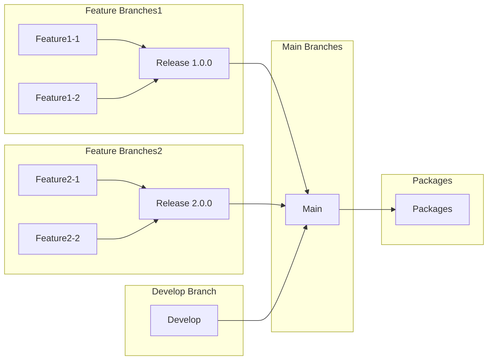

# Branches

- `main` branch는 publishing이 동작되는 branch입니다.
- `develop`은 packages dependencies를 관리하는 branch입니다.
- `release/*` branch는 특정 버전을 릴리즈하기 위한 branch입니다.
- `feature/*` branch는 특정 기능을 개발하기 위한 branch입니다. 배포하기 위해선 `release/*` branch로 merge합니다. 직접 `main` branch로 merge하지 않습니다.

간단하게 도식표를 보면 아래와 같습니다.

